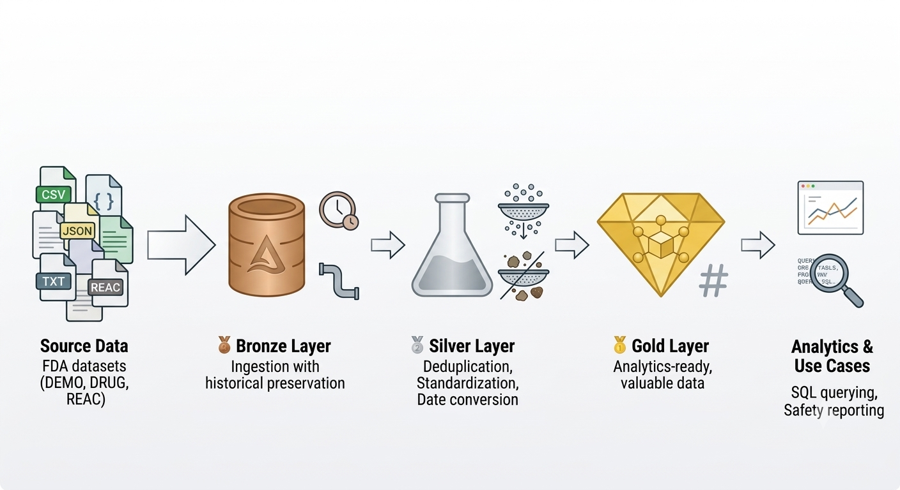
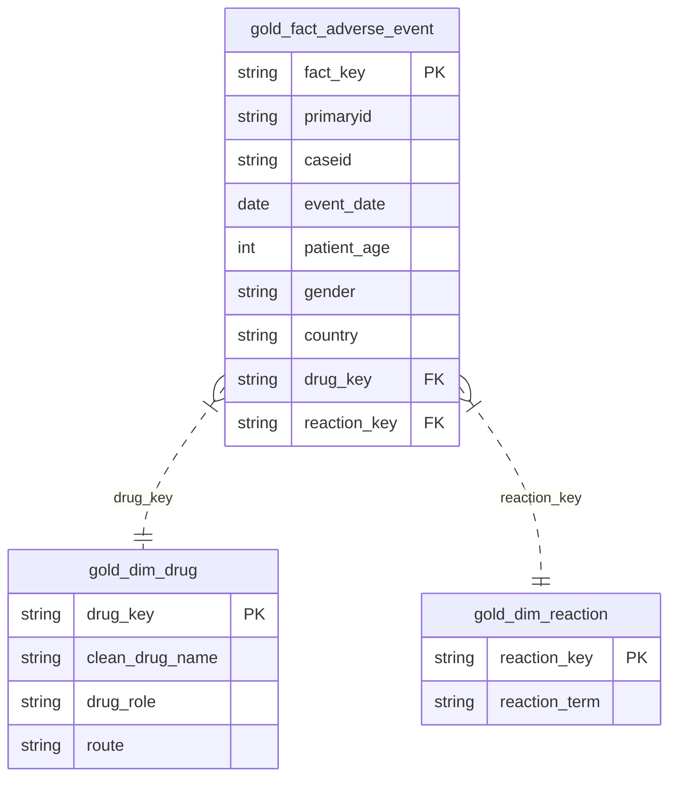

# 💊 FDA Drug Safety Lakehouse Pipeline (Medallion Architecture)

A production-grade **Data Lakehouse Pipeline** built on **Databricks** using **PySpark** and **Delta Lake**. This project ingests, cleanses, transforms, and models raw, semi-structured safety datasets from the **FDA Adverse Event Reporting System (FAERS)** into an analytics-ready **Star Schema**.

---

## 📌 Problem Statement

Pharmaceutical companies receive hundreds of thousands of adverse-event and medication-error reports quarterly. Raw safety data is often messy, inconsistent, contains duplicate report updates across quarters, and uses unstandardized drug names (e.g., brand names vs. generic names vs. typos).

This pipeline automates the data lifecycle: **Raw Ingestion $\rightarrow$ Data Cleansing & Standardization $\rightarrow$ Dimensional Modeling**, allowing pharmacovigilance safety teams and BI analysts to execute high-performance analytical queries.

---

## 🏗️ Architecture Overview

The pipeline follows the 3-tier **Medallion Architecture**:

### 🔄 Data Pipeline Breakdown

1. **Bronze Layer (Raw Ingestion):**

   * Ingests raw, multi-table FDA FAERS source datasets (`DEMO`, `DRUG`, `REAC`) into Delta Lake format.
   * Enriches raw data with an `ingestion_timestamp` metadata column to preserve data lineage and historical auditing without modifying source records.
2. **Silver Layer (Data Cleansing & Standardization):**

   * **Deduplication:** Filters out redundant report revisions by deduplicating records on FDA primary keys (`primaryid`).
   * **Data Cleansing:** Standardizes drug names and reaction terms using uppercase trimming (`upper(trim(...))`) to resolve typographical inconsistencies.
   * **Schema Normalization:** Maps codes (e.g., role code `PS` to `"Primary Suspect"`) and converts string dates (`YYYYMMDD`) into standard ANSI date datatypes.
3. **Gold Layer (Star Schema & Analytical Serving):**

   * **Dimensional Modeling:** Builds an optimized Star Schema comprising dimension tables (`gold_dim_drug`, `gold_dim_reaction`) and a centralized fact table (`gold_fact_adverse_event`).
   * **Deterministic Keys:** Uses PySpark `SHA-256` hashing on core composite business keys to generate immutable surrogate keys (`drug_key`, `reaction_key`, `fact_key`).
   * **BI Ready:** Optimized for high-speed downstream aggregations, SQL reporting, and pharmacovigilance safety analytics.

---

## 📊 Gold Layer Star Schema Design

<svg id="vditor-mermaid-3-1790616125066-0" width="100%" xmlns="http://www.w3.org/2000/svg" xmlns:xlink="http://www.w3.org/1999/xlink" class="erDiagram" style="max-width: 652.8750610351562px;" viewBox="0 0 652.8750610351562 758.25" role="graphics-document document" aria-roledescription="er"><g><g class="root"><g class="nodes"><g class="node default " id="vditor-mermaid-3-1790616125066-0-entity-gold_dim_reaction-2" data-look="classic" transform="translate(528.2250137329102, 643.375)"><g class="label attribute-keys" transform="translate(82.8000020980835, 30.75)" style=""><foreignObject width="0" height="0">

</foreignObject></g><g class="label attribute-comment" transform="translate(129.15000247955322, 30.75)" style=""><foreignObject width="0" height="0">

</foreignObject></g><g class="divider"><path d="M-116.65000247955322 -21.37505 L-116.65000247955322 -21.37495 L116.65000247955322 -21.37495 L116.65000247955322 -21.37505" stroke="none" stroke-width="0" fill="#3c3c3c" fill-rule="evenodd"></path><path d="M-116.65000247955322 -21.37505 C-116.65000247955322 -21.3750152421454, -116.65000247955322 -21.37498048429079, -116.65000247955322 -21.37495 M-116.65000247955322 -21.37505 C-116.65000247955322 -21.375024434503025, -116.65000247955322 -21.374998869006046, -116.65000247955322 -21.37495 M-116.65000247955322 -21.37495 C-36.01990763688421 -21.37495, 44.6101872057848 -21.37495, 116.65000247955322 -21.37495 M-116.65000247955322 -21.37495 C-59.591547196578816 -21.37495, -2.5330919136044088 -21.37495, 116.65000247955322 -21.37495 M116.65000247955322 -21.37495 C116.65000247955322 -21.374985490026145, 116.65000247955322 -21.375020980052287, 116.65000247955322 -21.37505 M116.65000247955322 -21.37495 C116.65000247955322 -21.374972452471958, 116.65000247955322 -21.374994904943915, 116.65000247955322 -21.37505 M116.65000247955322 -21.37505 C32.422341396392426 -21.37505, -51.80531968676837 -21.37505, -116.65000247955322 -21.37505 M116.65000247955322 -21.37505 C47.438610069403026 -21.37505, -21.77278234074717 -21.37505, -116.65000247955322 -21.37505" stroke="#3794ff" stroke-width="1.3" fill="none" stroke-dasharray="0 0"></path></g><g class="divider"><path d="M-52.525052479553224 -21.375 L-52.52495247955322 -21.375 L-52.52495247955322 64.125 L-52.525052479553224 64.125" stroke="none" stroke-width="0" fill="#3c3c3c" fill-rule="evenodd"></path><path d="M-52.525052479553224 -21.375 C-52.525018949618584 -21.375, -52.52498541968395 -21.375, -52.52495247955322 -21.375 M-52.525052479553224 -21.375 C-52.52502197905926 -21.375, -52.524991478565305 -21.375, -52.52495247955322 -21.375 M-52.52495247955322 -21.375 C-52.52495247955322 -3.789372061629731, -52.52495247955322 13.796255876740538, -52.52495247955322 64.125 M-52.52495247955322 -21.375 C-52.52495247955322 2.293082803990341, -52.52495247955322 25.961165607980682, -52.52495247955322 64.125 M-52.52495247955322 64.125 C-52.52497649157879 64.125, -52.52500050360436 64.125, -52.525052479553224 64.125 M-52.52495247955322 64.125 C-52.52498655129863 64.125, -52.52502062304404 64.125, -52.525052479553224 64.125 M-52.525052479553224 64.125 C-52.525052479553224 40.52084845598418, -52.525052479553224 16.91669691196836, -52.525052479553224 -21.375 M-52.525052479553224 64.125 C-52.525052479553224 37.756206572767205, -52.525052479553224 11.38741314553441, -52.525052479553224 -21.375" stroke="#3794ff" stroke-width="1.3" fill="none" stroke-dasharray="0 0"></path></g><g class="divider"><path d="M70.2999520980835 -21.375 L70.3000520980835 -21.375 L70.3000520980835 64.125 L70.2999520980835 64.125" stroke="none" stroke-width="0" fill="#3c3c3c" fill-rule="evenodd"></path><path d="M70.2999520980835 -21.375 C70.29998060799359 -21.375, 70.30000911790368 -21.375, 70.3000520980835 -21.375 M70.2999520980835 -21.375 C70.2999867655037 -21.375, 70.30002143292393 -21.375, 70.3000520980835 -21.375 M70.3000520980835 -21.375 C70.3000520980835 12.06997450235594, 70.3000520980835 45.51494900471188, 70.3000520980835 64.125 M70.3000520980835 -21.375 C70.3000520980835 6.118849881373045, 70.3000520980835 33.61269976274609, 70.3000520980835 64.125 M70.3000520980835 64.125 C70.3000316977671 64.125, 70.30001129745068 64.125, 70.2999520980835 64.125 M70.3000520980835 64.125 C70.30001401919547 64.125, 70.29997594030746 64.125, 70.2999520980835 64.125 M70.2999520980835 64.125 C70.2999520980835 45.48364579892714, 70.2999520980835 26.84229159785429, 70.2999520980835 -21.375 M70.2999520980835 64.125 C70.2999520980835 36.38151546478964, 70.2999520980835 8.638030929579294, 70.2999520980835 -21.375" stroke="#3794ff" stroke-width="1.3" fill="none" stroke-dasharray="0 0"></path></g><g class="divider"><path d="M-116.65000247955322 -21.37505 L-116.65000247955322 -21.37495 L116.65000247955322 -21.37495 L116.65000247955322 -21.37505" stroke="none" stroke-width="0" fill="#3c3c3c" fill-rule="evenodd"></path><path d="M-116.65000247955322 -21.37505 C-116.65000247955322 -21.37502462539041, -116.65000247955322 -21.37499925078082, -116.65000247955322 -21.37495 M-116.65000247955322 -21.37505 C-116.65000247955322 -21.37501448600234, -116.65000247955322 -21.37497897200468, -116.65000247955322 -21.37495 M-116.65000247955322 -21.37495 C-57.84327704454458 -21.37495, 0.963448390464066 -21.37495, 116.65000247955322 -21.37495 M-116.65000247955322 -21.37495 C-59.136682481277425 -21.37495, -1.6233624830016282 -21.37495, 116.65000247955322 -21.37495 M116.65000247955322 -21.37495 C116.65000247955322 -21.374989462668108, 116.65000247955322 -21.37502892533622, 116.65000247955322 -21.37505 M116.65000247955322 -21.37495 C116.65000247955322 -21.374975252017062, 116.65000247955322 -21.37500050403413, 116.65000247955322 -21.37505 M116.65000247955322 -21.37505 C63.95754888475026 -21.37505, 11.265095289947297 -21.37505, -116.65000247955322 -21.37505 M116.65000247955322 -21.37505 C33.19933458282141 -21.37505, -50.25133331391041 -21.37505, -116.65000247955322 -21.37505" stroke="#3794ff" stroke-width="1.3" fill="none" stroke-dasharray="0 0"></path></g></g></g></g></g><defs><filter id="vditor-mermaid-3-1790616125066-0-drop-shadow" height="130%" width="130%"><fedropshadow dx="4" dy="4" stdDeviation="0" flood-opacity="0.06" flood-color="#000000"></fedropshadow></filter></defs><defs><filter id="vditor-mermaid-3-1790616125066-0-drop-shadow-small" height="150%" width="150%"><fedropshadow dx="2" dy="2" stdDeviation="0" flood-opacity="0.06" flood-color="#000000"></fedropshadow></filter></defs><linearGradient id="vditor-mermaid-3-1790616125066-0-gradient" gradientUnits="objectBoundingBox" x1="0%" y1="0%" x2="100%" y2="0%"><stop offset="0%" stop-color="#3794ff" stop-opacity="1"></stop><stop offset="100%" stop-color="#59a4f9" stop-opacity="1"></stop></linearGradient></svg>
